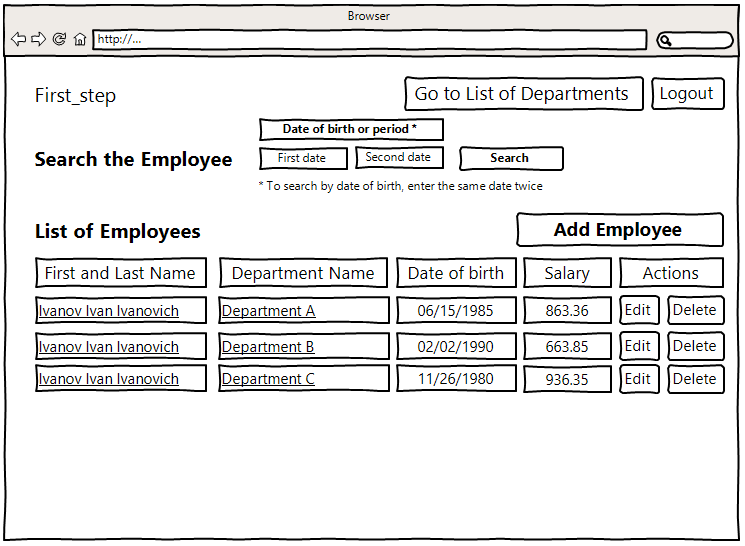
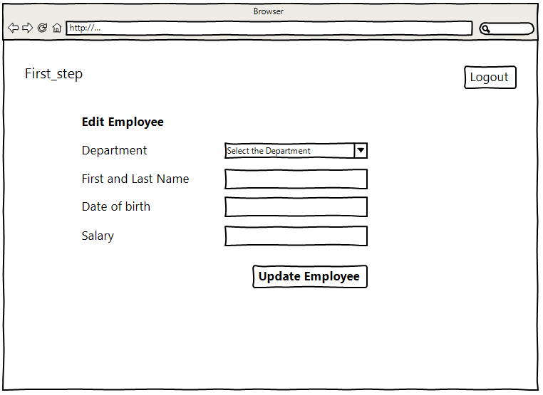

# 1 Introduction

## 1.1 Document Purpose

The purpose of this document is to present a detailed description of
“first_step” project. It will explain the purpose and features of the
application. This document is available for anyone to view and use for their own
aims. The features discussed in this document are mainly functional
requirements. These requirements are described in software development
perspective to easily grasp by use.

## 1.2 Project Scope

First_step is simple web application for managing departments and employees. The
web application use the aforementioned web service for storing data and reading
them from the database.

The web application allows:

-   display a list of departments and the average salary (calculated automatically) for these departments,

-   display a list of employees in the departments with an indication of the salary for each employee and a search field to search for employees born on a certain date or in the period between dates,

-   change (add/edit/delete) the above data.

## 1.3 Intended Audience and Document Overview

This document is intended for anyone how interested in learning about relations
between models in Django project on practice. Document also provides the general
product description and a technical outline for the requirements of this system.
Section two will give a high level description of the project functionality and
implementation details. Section three will give a more detailed description of
the specific requirements for different components of the application.

## 1.4 Difinitions

-   Python: high-level programming language

-   Django: a high-level Python Web framework

-   HTML5: is a core technology markup language of the Internet used for structuring and presenting content for the World Wide Web

# 2 Overall Description

## 2.1 Product Perspective

This application will consist of a backend and a front end. In the front end,
the user will directly interact with the web page, using the interface to get
the supported data requested from the database. In addition, the interface will
be used by users to make changes to the database. At the backend, our software
engine will allow us to aggregate data, store data, and produce results that are
useful to users.

First_step will be designed as two parts, the front and back end, that will be
used by end users. The front end will be a web application where the user may
interact with to see a visual representation of his own manipulations with the
database. The web application will be built on top of Django+Python and
interface with the Django-ORM to store and pull relevant data.

## 2.2 Product Functionality

-   The user will be able to populate database by required data

-   The user will be able to change (add/edit/delete) database data

-   The user must be able to take from database a list of departments and the average salary (calculated automatically) for these departments by displaying them on the screen

-   The user must be able to display a list of employees in the departments with an indication of the salary for each employee and a search field to search for employees born on a certain date or in the period between dates

## 2.3 Users and Characteristics

The users of our programming interface will be people involved in personnel
management and evaluation of the effectiveness of the use of personnel. The user
may take some time to get familiar with the layout and interface of our web
service, but should be able to easily understand what they are looking at.

## 2.4 Operating Environment

First_step will primarily act as a web service that will be supported on web
browsers including Google Chrome and Firefox. We assume that the underlying
operating system is Windows or Linux.

First_step will be running on a local server that has Django, Python 3.9 version or later and
Django-ORM running on it.

Figure 1. Operating Environment

## 

## 2.5 Design and Implementation Constraints

Design:

-   Language: Python with Django, HTML5, CSS3

-   Database: Django-ORM

-   Server: local server

Constraints:

-   Must run on Google Chrome and Firefox

-   Web application is only use for managing departments and employees

-   The web application use the web service for storing data and reading them from the database.

-   All public functions/methods on all levels include unit tests

## 2.6 User Documentation

Everything will be as simple as possible. Ideally, it will require no extra
explanation. A page with frequently asked questions and answers to them will be
available if necessary.

## 2.7. Assumptions and Dependencies

-   We assume the user has or has access to a computer or laptop

-   We assume the user has the necessary knowledge and skills to run a local server

-   We depend on the correct operation between Python+Django and the local server

# 3 Specific Requirements

# 3.1 External Interface Requirements

## 3.1.1 User Interfaces

**Main page**

The main page will allow user familiarize themselves with the purpose of the
application and follow the link to login.

****

**Login page**

The login page will allow users to log in to the application using their username. The user
will then be redirected to the "List of Departments page" upon successful login.

****

**Registration Page**

The registration page will provide a new user to create an account so that he or
she can start using the web application. The user must enter login, password and confirm password. 

**An error message marked in red text will be displayed below if the user does not enter data in one of the fields or if the form field is not filled in according to the requirements below.**

**Username requirements:**

1. length from 6 to 30 characters
2. valid characters: English alphabet letter in any case, Arabic numeral, dot and dash
3. the first character can only be a letter
4. the last character can be either a digit or a letter
5. two dots and two dashes in a row, as well as combinations of dots and dashes (.-, -.) are prohibited

**Password requirements:**

1. length from 8 to 30 characters
2. password must not match username
3. password must contain characters typed in different cases
4. must contain Latin letters, numbers, special characters (! » # $ % & ‘ ( ) * + , — . / : ; < = > ? @ [ ] ^ _` { | } ~)

****

**List of Departments page**

This page will allow user to see the names of departments and the average salary
in each department.

****

**List of Employees**

This page will allow user to see the employees of the current department. This
page also allows you to search by employee's date of birth or a specified period
and to choose specific actions: add, edit, delete employee data.

**Fields requirements:**

"First date" or "Second date" buttons: the date is entered only in numbers in the following template "__ /__ /____". The number of characters should only be equal to 8 (eight).

****

**Add Employee page**

This page will allow the user to add a new employee to the selected department.

**An error message marked in red text will be displayed below the field if the user does not enter data in one of the fields or if the form field is not filled in according to the requirements below.**

**Fields requirements:**

1. First and Last Name: contain only English alphabet letter in different cases, space and roman numerals if needed. Length from 4 to 50 characters.
2. Date of birth: the date is entered only in numbers in the following template "__ /__ /____". The number of characters should only be equal to 8 (eight).
3. Salary: the date is entered only in numbers in the following template "0.00" (value cannot be less than zero). The number of characters after the decimal point is not more than 2 (two). 

****

**Edit Employee page**

This page will allow the user to make changes to the data of an employee of the
selected department.

**The requirements for filling in the fields of this section are similar to the section "Add Employee page".**

****

**Delete Employee page**

This page will allow the user to delete an employee of the selected department.

****

**Add department page**

This page will allow the user to create a new department by naming it.

**An error message marked in red text will be displayed below the field if the user does not enter data in the field or if the form field is not filled in according to the requirements below.**

**Fields requirements**: contain only English alphabet letter in different cases, space and arabic numerals if needed. Length from 4 to 50 characters.

****

**Edit department page**

This page will allow the user to make changes to the data of the selected department.

**The requirements for filling in the fields of this section are similar to the section "Add department page".**

****

**Delete department page**

This page will allow the user to delete selected department.

****

**An error message marked in red text will be displayed below about the impossibility of deleting the department 
if the is at least one employees in the department.**

****

## 3.1.2 Hardware Interfaces

The user may also access our software through a web browser on their desktop or
laptop. Under the assumption that the user is using a traditional computing
environment, the user may interact via mouse clicks and keyboard inputs.

## 3.1.3 Software Interfaces

Both Windows and Linux will interact with our web interface (via web browser) to

display the data to the user via a web browser.

## 3.1.4 Communications Interfaces

The user will be accessing the web interface using HTTPS when accessing our
application using a laptop/desktop on a web browser.

# 3.2 Functional Requirements

## 3.2.1 Storage

-   The application has to be able to collect data

-   The application has to be able to output data on demand

-   The application has to be able to update user information

## 3.2.2 Web Interface

-   The user must be able to interact with the software to determine the dataset he wishes to analyze

-   The user must be able to log in and out of the system

## 3.2.3 User Stories

**User Story 1**

As a user, I want to login to First_step so that I can see List of Departments
page.

**Acceptance Criteria:**

*Scenario 1:*

The user has a First_step account

And the user has entered their information correctly

When the user enters their First_step username and password

Then the app will redirect the user to the List of Departments page

*Scenario 2:*

The user does not have a First_step account

When the user clicks the register link

Then the app will redirect the user to a registration page

**User Story 2**

As a user, I want to know when I enter my credentials incorrectly so that I can
try to login again or change my password if needed.

**Acceptance Criteria:**

*Scenario 1:*

Given the user has a First_step account

And the user tries to login

When the user enters his or her First_step username and password incorrectly

Then the application will display a red comment at the bottom of the login page that says “username or password incorrect.

**User Story 3**

As a user, I want to see "List of Employees" page.

**Acceptance Criteria:**

*Scenario 1:*

The user enters their First_step username and password

Then the app will redirect the user to the "List of Departments" page

And the user selects a department by clicking on the department name link

Then the app will redirect the user to the List of Employees of chosen Department

**User Story 4**

As a user, I want to Add an Employee.

**Acceptance Criteria:**

*Scenario 1:*

The user is on the page "List of Employees"

And the user selects by clicking on the Add Employee button

Then the app will redirect the user to the "Add an Employee" page

Then the user must enter the data in accordance with the requirements

There could be only two scenarios:

1.  if the user enters invalid data or data is not in all the required fields, error messages appear under the corresponding fields highlighted in red. The user cannot save the data until they enter valid data.
2.  if the user enters valid data in all the required fields, the user is redirected to the page about the successful addition of the employee's data.

**User Story 5**

As a user, I want to Edit an Employee.

**Acceptance Criteria:**

*Scenario 1:*

The user is on the page "List of Employees"

And the user selects by clicking on the Edit button

Then the app will redirect the user to the "Edit an Employee" page

Then the user must enter the data in accordance with the requirements

There could be only two scenarios:

1.  if the user enters invalid data or data is not in all the required fields, error messages appear under the corresponding fields highlighted in red. The user cannot save the data until they enter valid data.
2.  if the user enters valid data in all the required fields, the user is redirected to the page about the successful changes of the employee's data.

**User Story 6**

As a user, I want to Delete an Employee.

**Acceptance Criteria:**

*Scenario 1:*

The user is on the page "List of Employees"

And the user selects the employee by clicking on the Delete button

Then the app will redirect the user to the "Delete the Employee" page

There could be only two scenarios:

1.  if the user does not have access rights to delete employee data error messages appear under the Delete button highlighted in red. The user will not be able to complete the operation until the appropriate access rights are granted to him.
2.  if the user has the necessary access rights to delete the employee's data, then after the deletion the user will be redirected to the page about the successful deletion of the employee's data.

**User Story 7**

As a user, I want to Add a Department.

**Acceptance Criteria:**

*Scenario 1:*

The user is on the page "List of Departments"

And the user selects by clicking on the Add Department button

Then the app will redirect the user to the "Add Department" page

Then the user must enter the data in accordance with the requirements

There could be only two scenarios:

1.  if the user enters invalid data or the field is empty, error messages appear under the field highlighted in red. The user cannot save the data until they enter valid data.
2.  if the user enters valid data in the field, the user is redirected to the page about the successful changes of the department's data.

**User Story 8**

As a user, I want to Edit the Department.

**Acceptance Criteria:**

*Scenario 1:*

The user is on the page "List of Employees"

And the user selects by clicking on the Edit button

Then the app will redirect the user to the "Edit department" page

Then the user must enter the data in accordance with the requirements

There could be only two scenarios:

1.  if the user enters invalid data (including - incorrect name of an existing department) or data is not in all the required fields, error messages appear under the corresponding fields highlighted in red. The user cannot save the data until they enter valid data.
2.  if the user enters valid data in all the required fields, the user is redirected to the page about the successful changes of the department's data.

**User Story 9**

As a user, I want to Delete the Department.

**Acceptance Criteria:**

*Scenario 1:*

The user is on the page "List of Departments"

And the user selects the Department by clicking on the Delete button

Then the app will redirect the user to the "Delete the Department" page

There could be only three scenarios:

1.  if the user does not have access rights to delete Department data error messages appear under the Delete button highlighted in red. The user will not be able to complete the operation until the appropriate access rights are granted to him.
2.  if the is at least one employee in the Department error messages appear under the Delete button highlighted in red. The user will not be able to complete the operation until the department maintains at least one employee.
2.  if the user has the necessary access rights to delete the Department's data, then after the deletion the user will be redirected to the page about the successful deletion of the Department's data.

**User Story 10**

As a user, I want to Search a specific Employee by employee's date of birth or
within a specified period.

**Acceptance Criteria:**

*Scenario 1:*

The user is on the page "List of Employees"

The user has entered employee's date of birth or a specified period in accordance with the requirements and 
selects search by clicking on the Search button

Then the app will refresh the page List of Employees in according to search data

# 4 Non-Functional Requirements

## 4.1 Performance Requirements

-   Clicking any link should take less than 1 second

-   Updating and saving any personal information should take less than 1 second

-   Search on the page List of Employees should take less than 3 seconds

-   The application must support 100 clients on the basis that each client makes an average of 200 requests during the working day (from 09:00 to 18:00) 

## 4.2 Safety and Security Requirements

-   The user’s login information should be secure enough so that anyone except for the developers will know that user’s username/email and password

-   When the user types his or her password to login, it should be hidden

-   The system should be secure enough so that the user’s personal information will not be disclosed to unauthorized users

-   The system should be secure enough to prevent the corruption of data from unauthorized users

-   The system should be secure enough to protect against denial-of-service attacks

## Software Quality Attributes

### 4.3.1 Availability

-   The system must deliver services to the client when requested

### 4.3.2 Dependability

-   The application must be reliable enough so that when users perform normal functions, the system does not fail

### 4.3.3 Usability

-   The application must be easy enough to learn so that users know how to use the product entirely on their first try

### 4.3.4 Flexibility

-   The application must be flexible enough to support Google Chrome and Firefox browsers

-   The application must be able to support Windows and Linux operating systems
